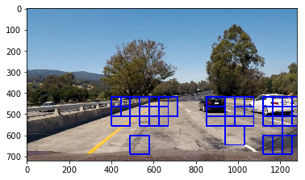
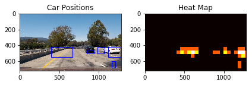

# Vehicle Detection

The objective of this project is to create a robust software pipeline to continously detect vehicles in a recording video by a camera mounted right on the front of a car. Several techniques are either reviewed or combined in the pipeline to achieve robustness.

Applied Techniques & Goals
---

The goals / steps of this project are the following:

* Perform a Histogram of Oriented Gradients (HOG) feature extraction on a labeled training set of images and train a classifier Linear SVM classifier
* Optionally, you can also apply a color transform and append binned color features, as well as histograms of color, to your HOG feature vector. 
* Note: for those first two steps don't forget to normalize your features and randomize a selection for training and testing.
* Implement a sliding-window technique and use your trained classifier to search for vehicles in images.
* Run your pipeline on a video stream (start with the test_video.mp4 and later implement on full project_video.mp4) and create a heat map of recurring detections frame by frame to reject outliers and follow detected vehicles.
* Estimate a bounding box for vehicles detected.

Here are links to the labeled data for [vehicle](https://s3.amazonaws.com/udacity-sdc/Vehicle_Tracking/vehicles.zip) and [non-vehicle](https://s3.amazonaws.com/udacity-sdc/Vehicle_Tracking/non-vehicles.zip) examples that I used to train my linear SVC classifier.  These example images come from a combination of the [GTI vehicle image database](http://www.gti.ssr.upm.es/data/Vehicle_database.html), the [KITTI vision benchmark suite](http://www.cvlibs.net/datasets/kitti/), and examples extracted from the project video itself. Please notice that, all [vehicle](https://s3.amazonaws.com/udacity-sdc/Vehicle_Tracking/vehicles.zip) images are PNG while all the [non-vehicle](https://s3.amazonaws.com/udacity-sdc/Vehicle_Tracking/non-vehicles.zip) are JPEG. Therefore, a conversion is recommended to apply for image scale consistency.

Six example images for testing this pipeline on single frames are located in the `test_images` folder. Examples of the output from each stage of your pipeline are saved in the folder called `ouput_images`, and are included in this writeup for the project by describing what each image shows.   

The video called `project_video.mp4` is the video this pipeline should work well on, and the 'output_video.mp4' is produced to detect vehicles by the pipeline in a continous basis.

Pipeline overview
---

### Histogram of Oriented Gradients (HOG)

#### 1. Extract HOG features from the training images.
First, the program reads in ALL `vehicle` and `non-vehicle` images by a pre-defined function 'ReadOImgs' which only accpets PNG & JPEG. As a result, 8792 images from 'vehicle' and 1125 'non-vehicle' are read into memory. To balance the sample numbers of these two classes, I chose a sample size of 800 to equalize them.

Second, a composite function 'extract_features' (transform color, create histogram, get hog_features and concatenate color & shape features) are applied to create car_features & notcar_features, which are the input for a typical data preparation:
* fit a per-column scaler
* apply the scaler to X
* split training data into training & test datasets with a ratio of 80/20.

#### 2. Choose HOG parameters & train a linear SVC classifier with extracted features
I was lost when I first try different HOG parameters. But after hours of trial-and-errors, I realize several interesting facts:
* The Linear SVC classifier's accuracy was usually around 1.0 even if I decreases the sample number. So it seems not to be a reliable classifier, which might have a risk of overfitting.
* YCrCb seems to work best in terms of reliability and accuracy in this case.
* Orient value & spatial_size should not be too high
* Still, 80/20 as the training vs testing split ratio works best in my case

I have no answers to support the observation, and therefore more explorations are needed to verify the validity.

### Sliding Window Search

#### 1. Define sliding window search.
* Define windows to search with lesson function `slide_window`.
* Implement sliding window search with lesson function `search_windows`.

#### 2. Examples of test images.
I intend to only cover the bottom half the whole horizon because the pipeline appears not to capture anything in the sky and the left & right sides.

Sample image:

---

### III. Video Implementation

#### 1. Final video output. 

[Video result](output_video.mp4)

#### 2. Filter for false positives and some method for combining overlapping bounding boxes.

*  Construct a heatmap from very recent frames of video
*  dismiss false positives by applying thresholds.

Sample image of heatmap & labels:

---

## 4. Discussion

#### 1. Problems?

The main problem I have encountered in the video is that, the pipeline fails to contiously capture vehicles as they appear. The wierd part of this problem is that, in a 'easy scenario' the pipeline 'stops' working while works very good in some cases that I feel hard to recognize. I guess this problem might be caused by 
* A unreliable linear classifier that I trained for performance convenience
* A low quality implementation of false positives approach.